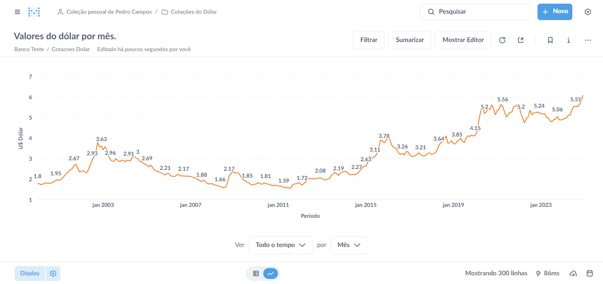
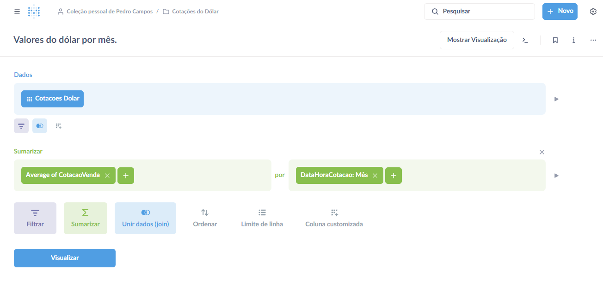
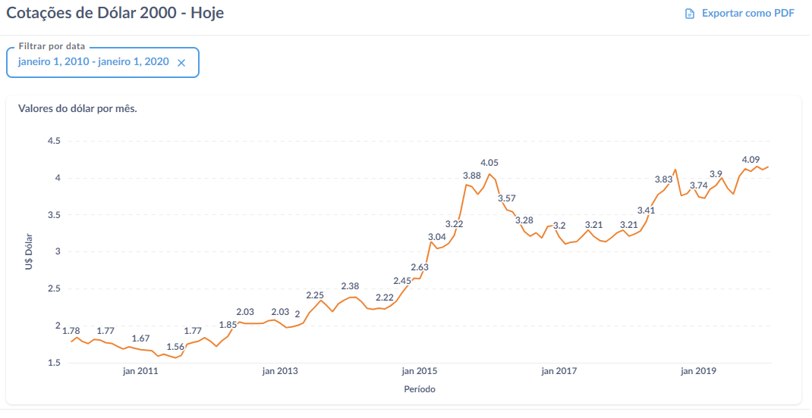

# Cotação do Dólar para Real 2000 - 2024 /// Dolar cotation to Real 2000 - 2024
Este projeto envolve montar uma extração de dados do Banco Central do Brasil (BACEN), sobre as variações do Dólar americano para o Real brasileiro utilizando Python e a biblioteca pandas. Depois montar uma visualização de dados utilizando o Metabase, um aplicativo de código aberto similar ao Power BI.

Ferramentas e softwares utilizados:
- Visual Studio Code (Gratuito).
- Python (Linguagem de código aberto).
- Metabase (Código aberto).

# 1° Extração de dados da API do BACEN
Seguindo o arquivo chamado [Extração_de_dados_para_uma_tabela](Extracao_de_dados_para_uma_tabela.py).
O arquivo python realiza a extração dos dados da API, e em seguida insere estes dados em uma tabela local do PostgreSQL.

# 2° Visualização de dados pelo Metabase
Com os dados das cotações já colocados na tabela do banco, através do Metabase é criada a visualização destes dados de forma a montar uma pergunta (question), e ajustar a visualização com base na média de cotações agrupadas por mês.

# 3° Dashboard
Por fim com a pergunta (question) montada no Metabase. É criada a visualização como dashboard, já incluindo a opção de filtragem por datas.

# 4° Considerações
Neste projeto, é possível expandir a visualização e aprimorar o código Python para ser mais eficiente, porém considerando que a visualização de dados se manteve pequena devido a análise ser feita somente considerando o último século, tudo foi mantido simples para fins de estudos.

# /// English version:

This project revolves in making an data extraction from the brazilian central bank (BACEN), about the variations of the US Dolar to the brazilian Real via Python and the pandas library. After that making a data visualizations using Metabase, an open-source application similar to Power BI.

Tools and softwares used:
- Visual Studio Code (Free).
- Python (Open source language).
- Metabase (Open source).
- Apache Hop *Extra* (Open source).

# 1° Data extraction from BACEN's API
following the file called [Extração_de_dados_para_uma_tabela](Extracao_de_dados_para_uma_tabela.py) (that also has comments and explanation in english).
The Python file makes the data extraction from the API, and the inserts the data into a local PostgreSQL database.

# 2° Data visualization through Metabase
With the cotation data already in the database table, using Metabase, we create a data visualization with a "question", and adjust it by the average values of the cotation grouped by each month.

# 3° Dashboard
Finally with the question ready, the dashboard is created in Metabase, already including the date period filter.

# 4° Review
On this project it is possible to expand the visualization and improve the Python code to be more efficient, though considering that the data is considerably small only including the last century, everything was maintaned simple for study purposes.